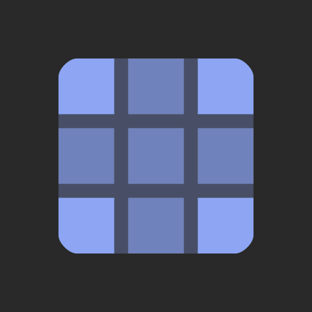

#  NinePatchSprite2D

A Node2D that displays a texture by keeping its corners intact, but tiling its edges and center.

> [!TIP]
> This add-on has built-in documentation, usage instructions and references can be consulted directly in the Godot editor via the  **Search Help** (``F1``).
